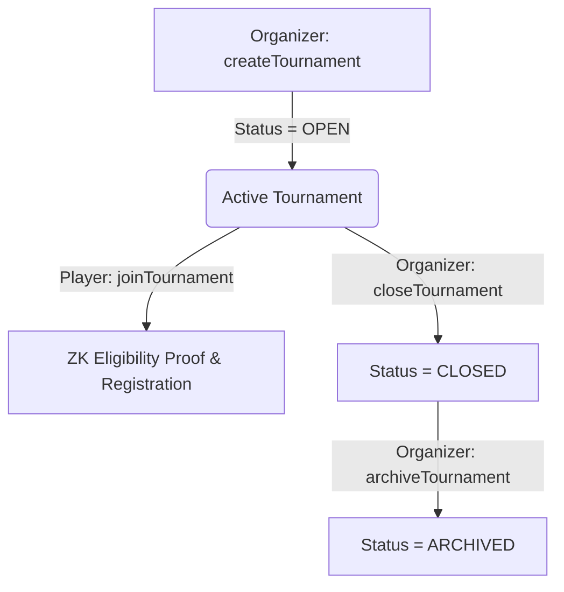

# PrivateRank Level 4 Architecture Specification

PrivateRank is a privacy-preserving esports tournament infrastructure built natively for the **Midnight Preprod Testnet** utilizing **Compact smart contracts** and **1AM Wallet** authentication.

---

## 1. System Overview & Core Invariants

PrivateRank decouples public, verifiable gaming performance from sensitive personal identification:

| Data Class | Attributes | Storage & Visibility |
| :--- | :--- | :--- |
| **Public Gaming Credentials** | Rank Tier, Skill Score, Match Wins, Losses | Encrypted on-chain commitment / Verified via ZK circuit |
| **Private Personal Identity** | Real Name, Email, Phone Number, Country, Date of Birth | Kept 100% client-side in user's browser, NEVER sent on-chain |
| **Tournament State** | Tournament ID, Capacity, Entry Criteria, Status | Midnight Preprod Ledger (`tournaments` map) |

---

## 2. On-Chain Compact Circuits

The canonical PrivateRank contract (`ba1936191e07a61db40154cf2bf9dd797fde14d3304323231e3b39b7a6d1dcde`) defines four core circuits:



1. **`createTournament(tournamentId, organizer, minRank, minScore, minWins, deadline)`**:
   - Stores entry requirements, capacity, and organizer unshielded public key.
   - Initializes tournament in `OPEN` (status 1) state.

2. **`joinTournament(tournamentId, playerKey, proof)`**:
   - Evaluates client-generated Zero-Knowledge proof against tournament criteria.
   - Enforces capacity limits and prevents duplicate player registrations.
   - Increments on-chain applicant counter.

3. **`closeTournament(tournamentId, organizer)`**:
   - Requires caller identity to match the registered organizer.
   - Transitions tournament status from `OPEN` (1) to `CLOSED` (2).
   - Ceases all new player entries and team joins.

4. **`archiveTournament(tournamentId, organizer)`**:
   - Enforces precondition: tournament must be in `CLOSED` (2) or `COMPLETED` (3) state.
   - Transitions status to `ARCHIVED` (4).
   - Keeps historical data accessible on Midnight blockchain while hiding event from active player explore listings.

---

## 3. Transaction & 1AM Wallet Pipeline

PrivateRank uses real Midnight Preprod ledger wire payloads:

```text
[Frontend Action]
       │
       ▼
1. Compile / Execute Compact Circuit
       │
       ▼
2. Generate ZK Proof via Proof Server / WASM CostModel
       │
       ▼
3. Construct Ledger Transaction Intent
   (intent = intent.addCall(callPrototype))
       │
       ▼
4. Serialize Unsealed Transaction to Wire Binary
       │
       ▼
5. 1AM Wallet balanceUnsealedTransaction(unsealedHexTx)
   -> Prompts User Approval Modal
   -> Balances Fees in DUST
       │
       ▼
6. 1AM Wallet submitTransaction(balancedWireTx)
   -> Broadcasts standard wire header:
      midnight:transaction[v9](signature[v1],proof,pedersen-schnorr[v1]);
       │
       ▼
7. Block Inclusion & Midnight Preprod Indexer Verification
```

---

## 4. Security & Role Invariants

- **Role Mutual Exclusion**: Organizers cannot participate in tournaments; Players cannot archive, close, or review tournaments.
- **Sequential Archive Execution**: If an organizer archives an `OPEN` tournament, PrivateRank automatically executes the on-chain `closeTournament` transaction first, awaits block confirmation, and then executes `archiveTournament`.
- **Zero-Mock Policy**: No optimistic state updates or mock transaction hashes. Operations only report success after block inclusion and indexer verification.
